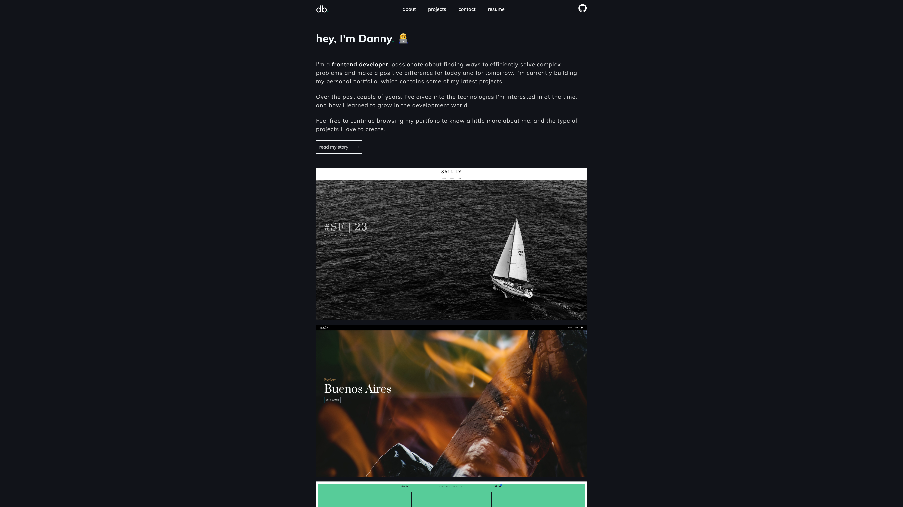

<h1>portfolio.db</h1>

<p>A showcase of my journey in web development. Explore a selection of my latest web applications, crafted with the latest technologies. </p>

<i>Note: as of August 2023 my personal portfolio web app has been updated to integrate TypeScript. Redesigned and re-engineered UI components with React. </i>

<h3>Table of Contents</h3>

```sh
1. About
2. Projects
3. Contact 
4. Resume
```

<h3>Technologies</h3>

```sh
React.js 
TypeScript
CSS
EmailJS 
Vercel
```

### [Live Demo](https://dbae.vercel.app/) 

### [GitHub Repository](https://github.com/danveb/portfolio.db)

<h1>Setup</h1>

Clone repo

```sh
$ git clone git@github.com:danveb/portfolio.db.git
```

Head to client on project directory where package.json/yarn.lock are located

```sh
$ cd portfolio.db/client
```

Install required dependencies 

```sh
$ yarn install
```

Start the server 

```sh
$ yarn start
```

<h3>EmailJS</h3>
EmailJS is a client-side email sending library that does not require any server-side code. It is integrated to the Contact page, where users can send me messages directly from the client. 

<br>

https://www.emailjs.com/docs/


Make sure to set up your account at EmailJS to get your own private set of keys. Then add them as environment variables. 

```
REACT_APP_SERVICE_ID=SECRET
REACT_APP_TEMPLATE_ID=SECRET
REACT_APP_PUBLIC_KEY=SECRET
```

<h3>Test</h3>

Tested components via RTL (React Testing Library) 

```sh
$ yarn test --watchAll
OR
$ yarn test NAME_OF_COMPONENT.test.tsx
```

<br>

<h1>Gallery</h1>

<h3>Landing Page</h3>


### Figma (Prototype v1)
